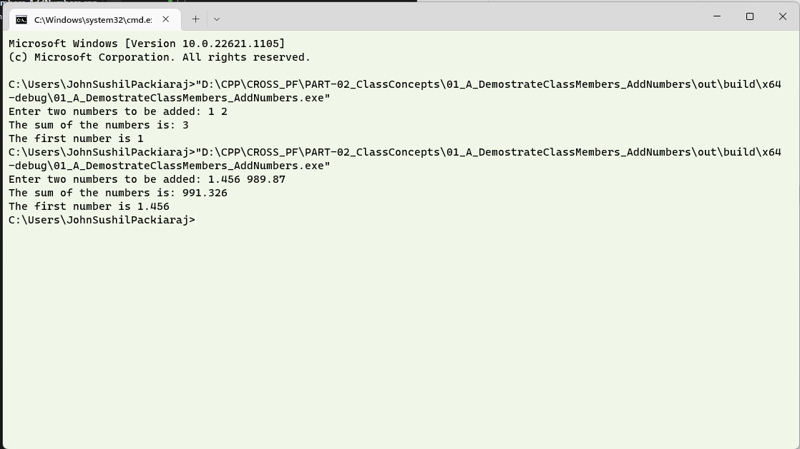

# Question #
Write a C++ program to add two numbers using a class named **AddTwoNumbers**.

The two numbers **dblA** and **dblB** are of data type _double_, stored as private members of **AddTwoNumbers**.  Write Constructors to set values to the two numbers from user input from keyboard.  Write a method **Sum()**, which will add the two numbers and store the results in a private property in the class named as  dblC.  Write a method getSoln(), which will return the output to the user.
## About the proposed solution ##
A proposed solution has been attached.  Please note that we have used exposed method **Sum()**.  In C++, an exposed method is a method that is declared as public within a class. Public methods can be accessed and called from outside the class, whereas private methods can only be accessed and called from within the class.

## Outline of Solution ##
In this program, the user is prompted to enter two numbers, which are then passed as arguments to the constructor of the class. The constructor sets the values of the private members **dblA** and **dblB** to the values passed as arguments. The **Sum()** method is then called to add the two numbers and store the result in dblC. Finally, the **getSoln()** method is called to return the value of **dblC**, which is the sum of the two numbers.
The cin pushes the input done by a user on the console to the variables.  We have added one more line to display the contents of the variables to help us gain insight on the order in which the items in the buffer will be pushed into variables by **cin**.
## Availability of the program ##
The proposed solution will be available after __03 Jan 2023__
## Output in a Console ##

## Discussion of Output ##
Open the file written by the program.  Now, try to give different values with different white spaces as  \n, \t or an enter key.  Study the way that the input is given and do a little reading on the same.  One of the biggest takeaway is that when a string is to be input, it will not be possible to use **cin** in the present form to get input for a string like say, _J S Packiaraj_, as there are spaces in the string.
