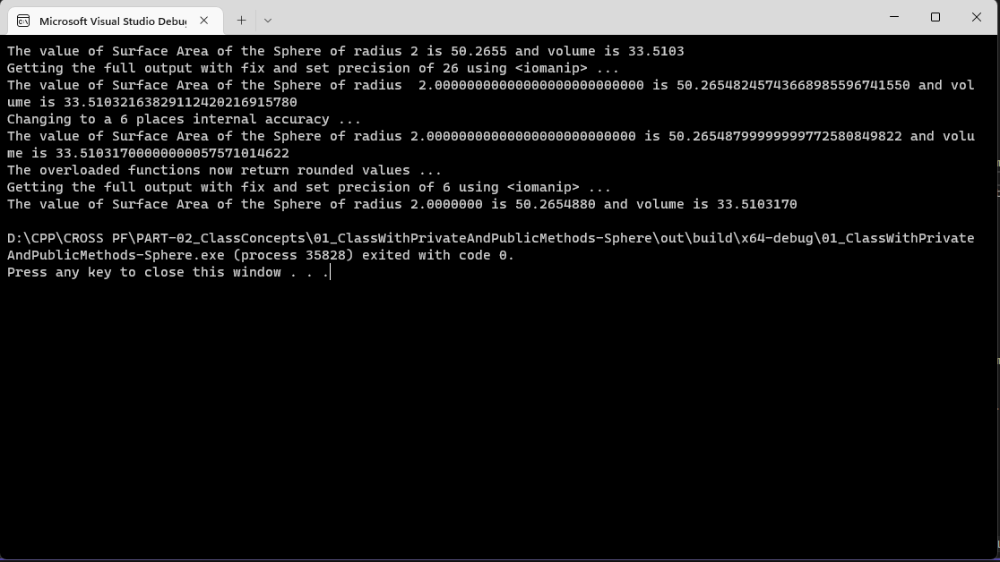

# Question #
Write a program to find the area of a circle to a precision of 3 decimal places.
## About the proposed solution ##
A proposed solution has been attached.  Although the question asks for a precision of 3 decimal places, the solution provided has the ability to take from the user the precision desired, working with a default of 10 decimal places.

The concepts of rounding adnd output precision using __\<iomanip\>__ have been further expanded upon.
## Outline of Solution ##
Here is an outline of the steps you can follow to find the surface area and volume of a sphere:
1. Start by inputting the radius r of the sphere.
2. Calculate the surface area of the sphere using the formula: surface area = 4 * pi * r2
3. Calculate the volume of the sphere using the formula: volume = (4/3) * pi * r3
4. Output the surface area and volume of the sphere.
> **Note**
> When the expression is given as 4/3, the resulting value will be truncated to an int, in otherwords 1.  To make sure that these constant values  will yield the desired floating point number,  cast one or both the values to a floating point. 
## Availability of the program ##
The proposed solution will be available after __09 Jan 2023__
## Output in a Console ##

## Discussion of Output ##
