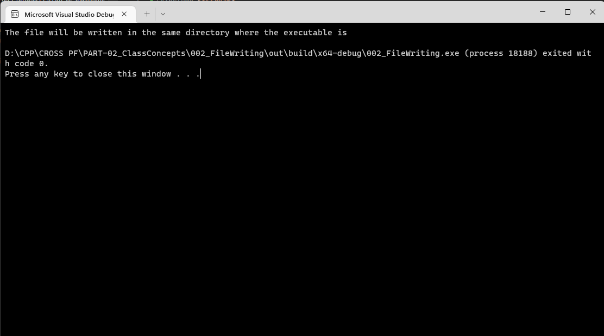

# Question #
Write a program to write a file using C++.
## About the proposed solution ##
A proposed solution has been attached.  Please note that the file will be written to the directory where the executable will be created.  In the case of my solution, it got written to 

```D:\CPP\CROSS PF\PART-02_ClassConcepts\002_FileWriting\out\build\x64-debug\```
## Outline of Solution ##
Here is an outline of the steps you can follow to find the surface area and volume of a sphere:
1. Start by creating a file object, with an __ofstream__ object, the file will be opened so that it can be written to.
2. Write to the file just as how you would write to console using __cout__.
> **Note**
> The line endings are generated according to the platform.  On windows machines, it will be __CR LF__.  On Linux machines, althoug __CR LF__ works, it is better to use _LF_. 
## Availability of the program ##
The proposed solution will be available after __03 Jan 2023__
## Output in a Console ##



## Discussion of Output ##
Open the file written by the program.  Now, try to change the output using __\<iomanip\>__ and discover the different possibilities.
