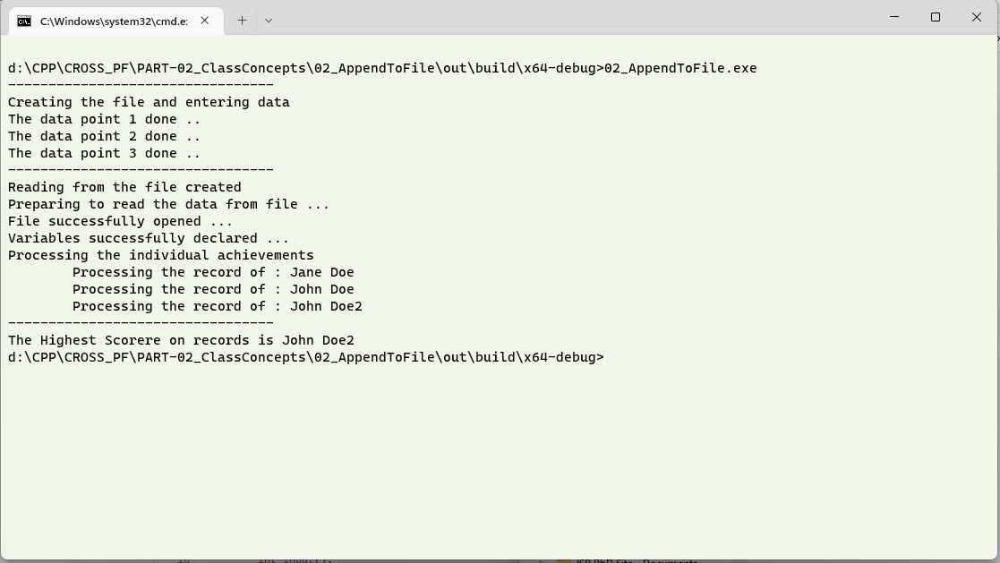

# Question #
Write a program to create a class write a file using C++.  The class will have members to hold the __name__, __age__ and __score__ of players.  It shall have a method to write the information about the players to the created class, which in turn will be written to file.
Another method shall read the data that you have written and print the name of the player with the highest score.
## About the proposed solution ##
A proposed solution has been attached.  Please refer to the previous programs for the cavets of file handling
## Outline of Solution ##
Here is an outline of the steps you can follow to find the surface area and volume of a sphere:
1. Start by creating an object to store the data
2. Crete the file object, with an __ofstream__ object, the file will be opened so that it can be written to.
3. Write to the file just as how you would write to console using __cout__.  In this case, it is advantageous to use the pointer to the object and write the data to the file.
> **Note**
> The file created has the datatype of the members of the class also stored.  Open the file in a text editor and check it up. 
## Availability of the program ##
The proposed solution will be available after __07 Jan 2023__
## Output in a Console ##

## Discussion of Output ##
Open the file written by the program.  You will notice that there are additional information written.  Although the output is still a text file.

