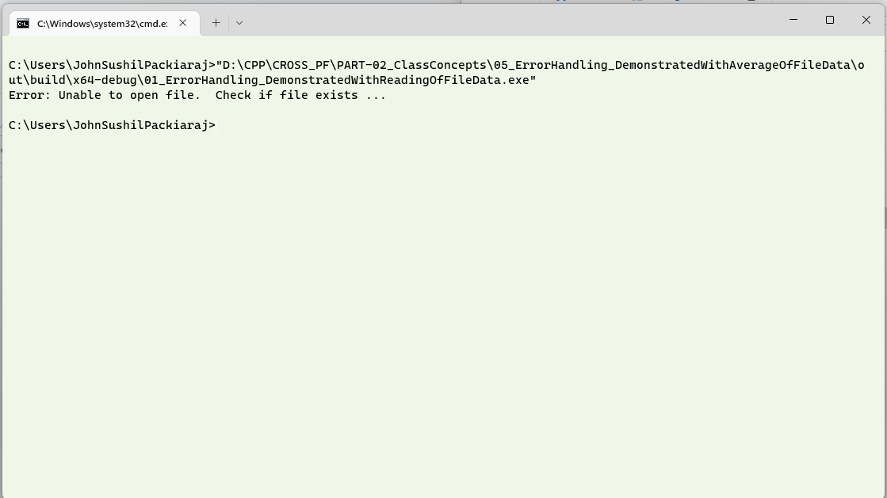
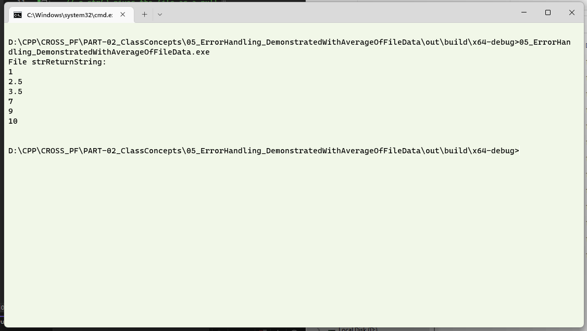

# Question #
Write a program which has a function to read information from a file using C++.  This function reads the file sent to it as a parameter.  Have a basic error handling mechanism to check if the file to be read is available in the specified path, otherwise give an error message out.
## About the proposed solution ##
A proposed solution has been attached.  A simple function reads the location mentioned and returns the content of the file if the file exists in the specified location.  Please note that the file will be read from the directory where the executable will be created.  In the case of my solution, it was 

```D:\CPP\CROSS_PF\PART-02_ClassConcepts\05_ErrorHandling_DemonstratedWithAverageOfFileData\out\build\x64-debug\```
> **Note**
> The file name contains \\.  As mentioned earlier, in languages like C and C++, the symbol '\' is used as a prefix for escape characters. Thus, to use it these symbols have to be escaped themselves.
> So, for the above path to be used as a string, it should be entered as 
> ```_D:\\CPP\\CROSS_PF\\PART-02_ClassConcepts\\05_ErrorHandling_DemonstratedWithAverageOfFileData\\out\\build\\x64-debug``` when storing them in strings.

Ensure that the directory where you have the executable has the file __input1.txt__ stored.
## Outline of Solution ##
Here is an outline of the steps you can follow to read a file and have a basic error handling:

The most common error occurs when the file is not available for a computer process because it is either locked by the operating system for another process, or it is not available in the location where the program is looking for it.  In this case, we will only check if the file is available, using the `if` statement.

1. The file which is to be opened is received as a parameter and the file is checked if it can be opened.
2. Read the file line by line and add a newline before storing it in a variable.  When there are no more lines in the file, return the contents of the file.
3. If there is an error in opening the file (Typically, file not found), a string with contents __FNF__ is returned.  This indicates that the file is  not available and the calling method, interprets the same accordingly.
> **Note**
> The line endings are generated according to the platform.  On windows machines, it will be __CR LF__.  On Linux machines, althoug __CR LF__ works, it is better to use __LF__.  In the attached file, the line endings are _LF_ and the character set is _UTF-8_ as seen in the image below in the status bar of notepad, which was used to open the file.
>

## Introducing the c_str() ##
`c_str()` is a function in the C++ standard library that returns a pointer to a string that ends with a null character and has the same characters as the string object it was called on.  The returned pointer is to a character array that is stored in the string object and is guaranteed to be valid until the string is changed.

The ifstream function Object() constructor takes as an argument a C-style string, which is a character array that ends with a null character.  In this programme, `fileName.c_str()` is used to transform the fileName string object into a null-terminated character array, which is what the ifstream constructor needs to open a file.  `fileName.c_str()` returns a pointer to the first character of the string object. This pointer is passed as an argument to the ifstream function Object() constructor to open the file.  It is important to remember that `c_str()` does not guarantee that the C-style string will still be valid after the string object is changed. 

## Output in a Console ##
The following output is one in which the file is not available is not available in the directory where the executable is run from.



The contents of the file __input1.txt__ is read and the screen shot of the same is shown below.

>

## Discussion of Output ##
1. Open the directory and change the file name.  See what happens.  
2. Change the file name in the CPP file and compile it to read another file.
3. Uncomment the lines _34_ and _35_ and type the name of the file to be opened.
4. You can also try to change the location of the file which is to be read from.  This will be a good exercise to understand escaping paths. 
5. Open files other than the text files and try to see the contents.
> **Note**
> In this program, the FNF was something that we defined.  Any person using the function should know that the function will return an FNF status.  Extending this principle, when a function or method written by another programmer is being reused, the person using the other persons work should be throughly familiar with the intent and then use the contents.
