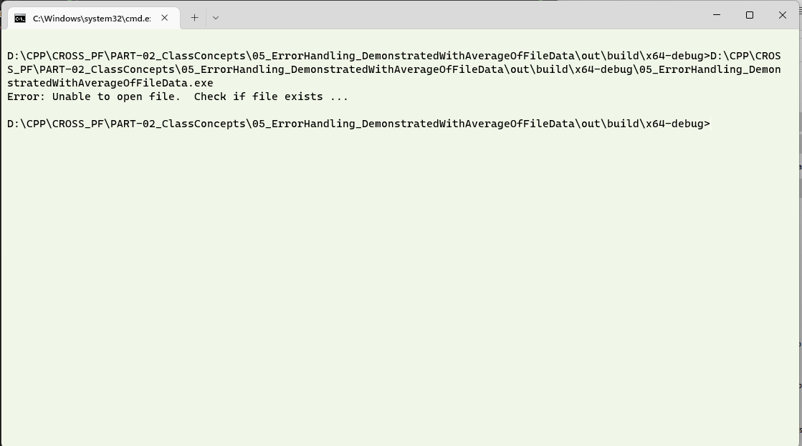
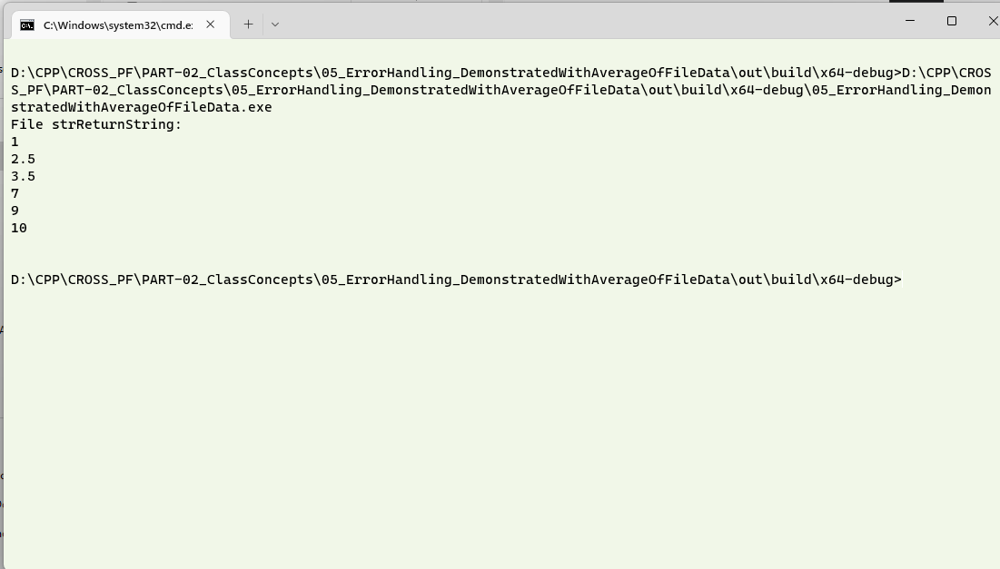

# Question #
Write a program which has a function to read information from a file using C++.  This function reads the file sent to it as a parameter.  Have a basic error handling mechanism to check if the file to be read is available in the specified path, otherwise give an error message out.
## About the proposed solution ##
A proposed solution has been attached.  This program is very similar to the previous exercise, with the exception that we will use the `try .. catch` block handle an error that is thrown by `throw`. As before, a simple function reads the location mentioned and returns the content of the file if the file exists in the specified location.  Please note that the file will be read from the directory where the executable will be created.

> **Note**
> Go through the previous exercises where additional information on file handling, escaping paths is available.  This exercise builds on the [previous exercise](../01_ErrorHandlingWithIf_FileReading/).

Ensure that the directory where you have the executable has the file __input1.txt__ stored.
## Outline of Solution ##
Here is an outline of the steps you can follow to read a file and have a basic error handling:

The most common error occurs when the file is not available for a computer process because it is either locked by the operating system for another process, or it is not available in the location where the program is looking for it.  In the previous case, the `if` statement was alone used for the error check.  
1. The file which is to be opened is received as a parameter and the file is checked if it can be opened.
2. Read the file line by line and add a newline before storing it in a variable.  When there are no more lines in the file, return the contents of the file.
3. If there is an error in opening the file (Typically, file not found), a string with contents __FNF__ is thrown by __throw__ which can be handled in the cach block.  This indicates that the file is  not available and the calling method, interprets the same accordingly.
> **Note**
> Refer to the note on the __c_str()__, and line termination character in the [previous exercise](../01_ErrorHandlingWithIf_FileReading/).

## Introducing the try .. catch block and the throw statement ##
Here, the `try block` has code that has a potential to have an errror.  The `throw` statement within the try block, is used to communicate that an error is present to a `catch` block.   On encountering an error, the __throw__ statement sends an error message specified by the programmer, which will be handled by the `catch` block.  This priciple can be used to build more involved error handlers, by having multiple __*catch*__ blocks.  The __*throw*__ statement interrupts the normal flow of the program and should be used in __*exceptional*__ situations only, in combination with a __*try .. catch*__ block.

## Output in a Console ##
The following output is one in which the file is not available is not available in the directory where the executable is run from.

The contents of the file __input1.txt__ is read and the screen shot of the same is shown below.

>

## Discussion of Output ##
As in the previous case,

1. Open the directory and change the file name.  See what happens.  
2. Change the file name in the CPP file and compile it to read another file.
3. Uncomment the lines _34_ and _35_ and type the name of the file to be opened.
4. You can also try to change the location of the file which is to be read from.  This will be a good exercise to understand escaping paths. 
5. Open files other than the text files and try to see the contents.
6. Look for some of the standard error messages encountered for diffferent conditions.
> **Note**
> 1. Error message in this case was what we specified.  Look for the standard errors which a programming language has to offer.
> 2. Try and understand the reason of a __return 0;__ or a __return
