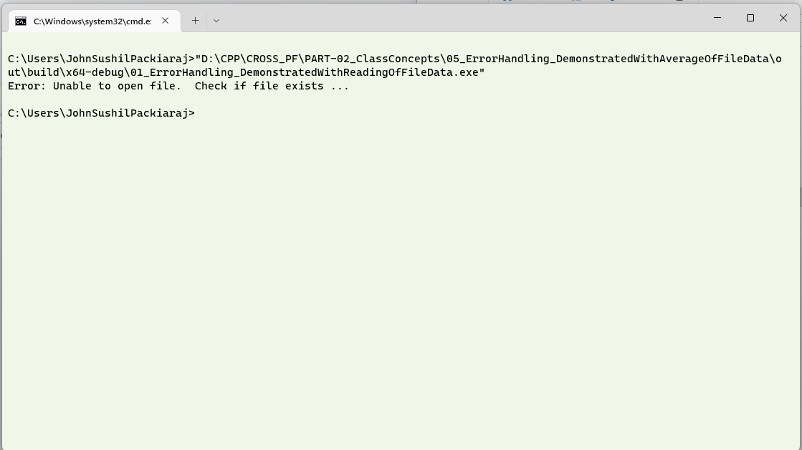

# Question #
Write a program which has a function to read information from a file using C++.  This function reads the file sent to it as a parameter.  Have a basic error handling mechanism to check if the file to be read is available in the specified path, otherwise give an error message out.
## About the proposed solution ##
A proposed solution has been attached.  A simple function reads the location mentioned and returns the content of the file if the file exists in the specified location.  Please note that the file will be read from the directory where the executable will be created.  In the case of my solution, it was 

```D:\CPP\CROSS_PF\PART-02_ClassConcepts\05_ErrorHandling_DemonstratedWithAverageOfFileData\out\build\x64-debug\```
> **Note**
> The file name contains \.  As mentioned earlier, in languages like C and C++, the symbol '\' is used as a prefix for escape characters. Thus, to use it these symbols have to be escaped themselves.
> So, for the above path to be used as a string, it should be entered as 
> ```_D:\\CPP\\CROSS_PF\\PART-02_ClassConcepts\\05_ErrorHandling_DemonstratedWithAverageOfFileData\\out\\build\\x64-debug``` when storing them in strings.
## Outline of Solution ##
Here is an outline of the steps you can follow to find the surface area and volume of a sphere:
1. The file which is to be opened is received as a parameter and the file is checked if it can be opened.
2. Write to the file just as how you would write to console using __cout__.
> **Note**
> The line endings are generated according to the platform.  On windows machines, it will be __CR LF__.  On Linux machines, althoug __CR LF__ works, it is better to use __LF__.  In the attached file, the line endings are _LF_ and the character set is _UTF-8_ as seen in the image below
>

## Availability of the program ##
The proposed solution will be available after __03 Jan 2023__
## Output in a Console ##


## Discussion of Output ##
Open the file written by the program.  Now, try to change the output using __\<iomanip\>__ and discover the different possibilities.
