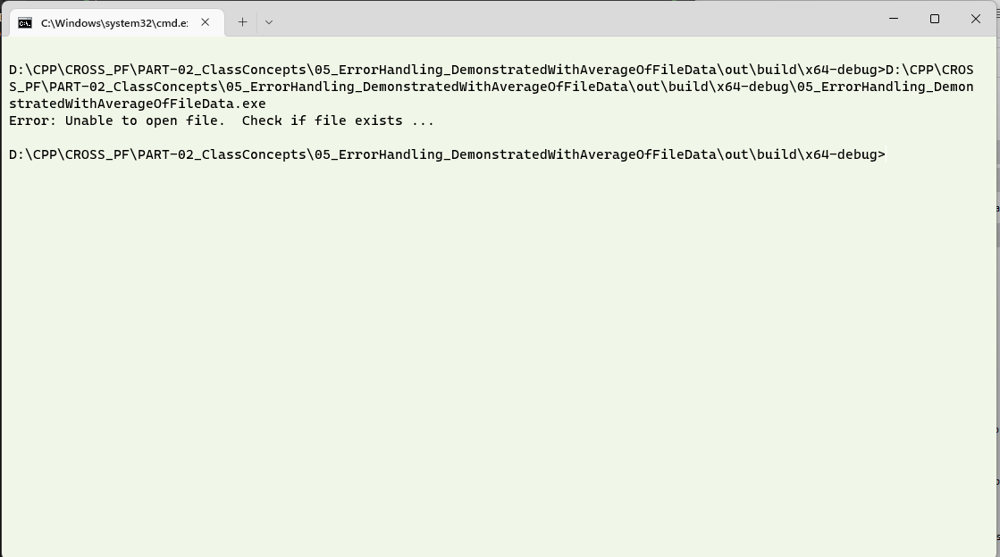
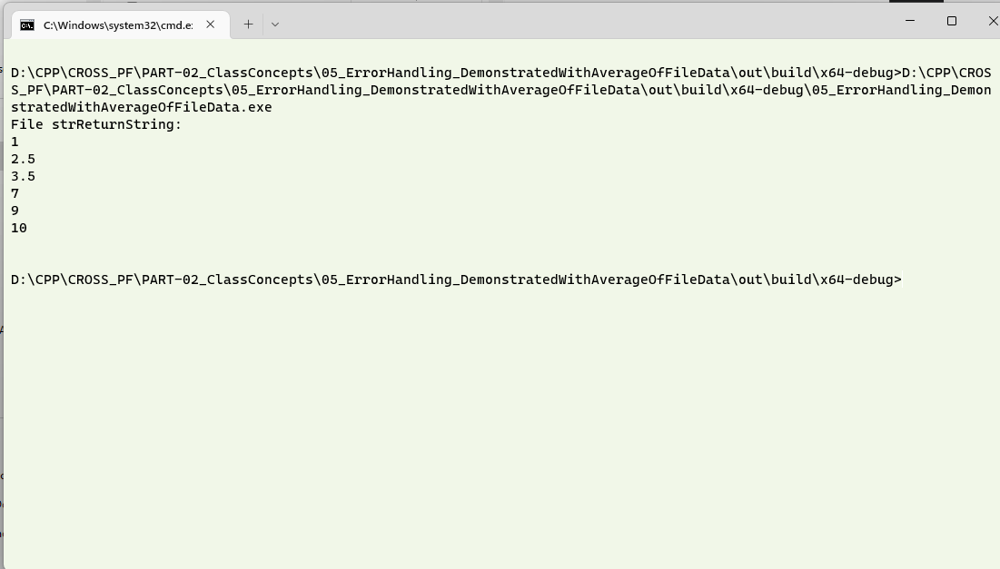

# Question #
Write a program which has a function to read information from a file using C++.  This function reads the file sent to it as a parameter.  Have a basic error handling mechanism to check if the file to be read is available in the specified path, otherwise give an error message out.
## About the proposed solution ##
A proposed solution has been attached.  This program is very similar to the [previous exercise](../02_ErrorHandlingWithTry_Catch_ReadingFiles/), with the exception that we will use the `try .. catch` block handle an error that is thrown by `throw`. As before, a simple function reads the location mentioned and returns the content of the file if the file exists in the specified location.  Please note that the file will be read from the directory where the executable will be created.

> **Note**
> Go through the previous exercises where additional information on file handling, escaping paths and information of the usage of `try .. catch` and the `throw` statement is available.  This exercise builds on the [previous exercise](../02_ErrorHandlingWithTry_Catch_ReadingFiles/).

## Outline of Solution ##
This exercise is the same as the [previous exercise](../02_ErrorHandlingWithTry_Catch_ReadingFiles/), but for the position where the `try .. catch` block has been placed.

## Output in a Console ##
The output of the program is similar to the previous exercise.  The following output is one in which the file is not available is not available in the directory where the executable is run from.

The contents of the file __input1.txt__ is read and the screen shot of the same is shown below.

>

## Discussion of Output ##
As in the [previous exercise](../02_ErrorHandlingWithTry_Catch_ReadingFiles/), 

1. Play around with the directory location of the file to be read and the other suggested activities.  
2. Which of the options do you find more elegant.
3. Note how the condition with error has been handled irrespective of the placement of the `try .. catch` block.  
4. Explore alternate places where error can be got (eg. Wrong data type getting input, divide by zero errors, overflow of variables, or when memory cannot be allocated) and think of the best way that these errors can be handled.
> **Note**
> 1. Error message in this case was what we specified.  C++ does not have standard errors, however, many libraries, frameworks and operating systems have their own error codes.  Look for the standard errors which you can capitalise upon.
> 2. It is a good practice for programmers or programming teams to develop their own standard error codes.  
> 3. To faciliate ease in debugging, it is a good practice to have the program communicate meaningful error messages.  In the previous programs, "__FNF__" was meant to communicate __File Not Found__.  Without this explanation, it will be difficult for a person to understand that it is an error message that we, as the programmers, had created.  On the other hand, a simple message '*File not found, check the path*', '*Operating System lock detected on file, wait for the file to be free or unlock the file*' would have been more useful.
> In this version of the `try .. catch`, you will find that the `throw` statement is throwing a more meaningful string.  This string is entirely at the discretion of the programmer. 
