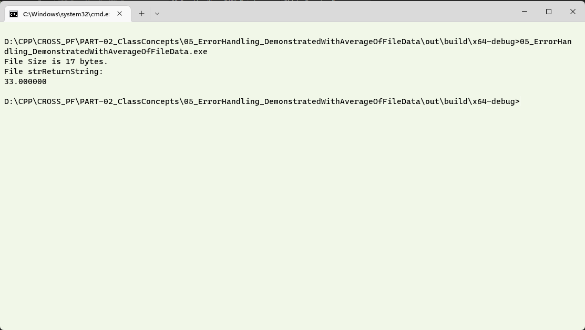
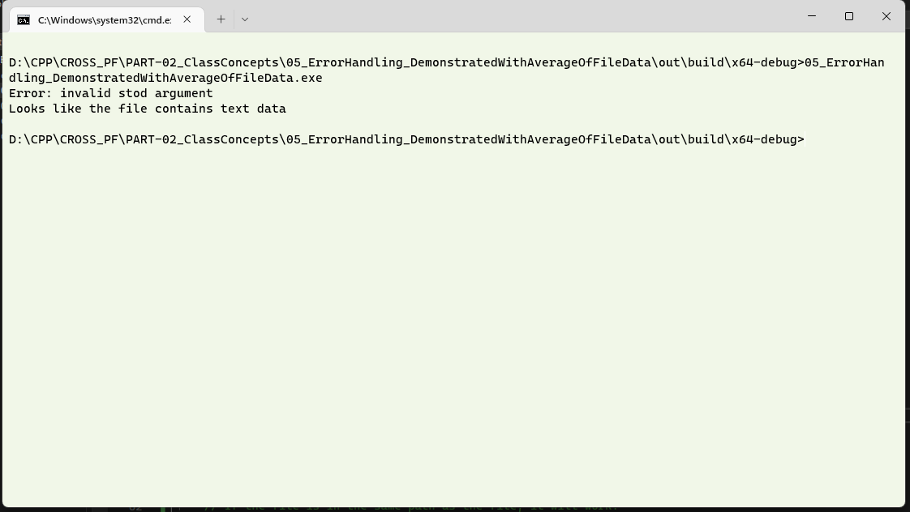
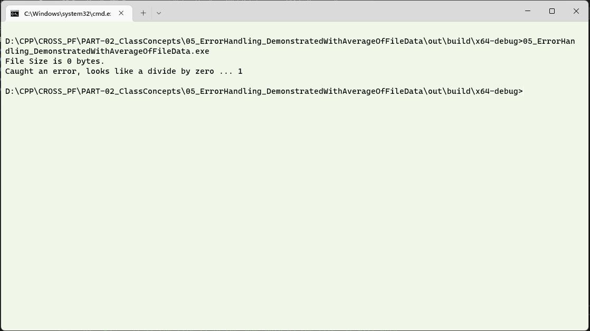

# Question #
Write a program which has a function to read the numeric information from a file using C++, and reports the size of the file and the average of the elements present in the file.  This function reads the file sent to it as a parameter.  Have error handling mechanism with multiple try .. catch blocks to handle exceptions thrown by the program as givn below:
1. check if the file to be read is available in the specified path, otherwise give an error message out.
2. check if the file has illegal data (non - numeric) and flag the same.
3. check if the file is a non-empty file, and if it is empty flag the same.
## About the proposed solution ##
A proposed solution has been attached.  This solution, aims to demonstrate  This program is very similar to the previous exercise, with the exception that we will use multiple `catch` blocks to handle the different errors that we predict that the program will thrown. As before, a simple function reads the location mentioned and returns the content of the file if the file exists in the specified location.  In addition, the size of the file is also captured by the program.  Please note that the file will be read from the directory where the executable will be created.

> **Note**
> Go through the previous exercises where additional information on file handling, escaping paths is available.  This exercise builds on the [previous exercise](../03_ErrorHandlingWithTry_Catch_AltSolnReadingFiles/).

## Outline of Solution ##
Here is an outline of the steps you can follow to read a file and have a basic error handling:

The most common error occurs when the file is not available for a computer process because it is either locked by the operating system for another process, or it is not available in the location where the program is looking for it.  In the previous case, the `if` statement was alone used for the error check.  
1. The file which is to be opened is received as a parameter and the file is checked if it can be opened.  An error of type **runtime_error** is thrown with a custom message.
2. Read the file line by line and convert the string to a double using the **stod()** function.  Here there is a chance that the string cannot be converted to a double, hence enclose the statement in a `try` block.  When the string cannot be converted, it will throw an error of data type **invalid_argument**.  Throw this error onward for the `main()` function to handle.
3. If the file does not contain any data, pass meaningful information to the end user.  This is also an error that will be handled by `main()`.  It is wished to demonstrate that the `catch` blocks need to be having a waterfall model where the most specific error datatype is handled before cascading down to the more generic types.  Unlike the previous two throw of an error, here the error is of datatype **int** and the error block in main which will have catch an error thrown of data type **int** will handle the same.
> **Note**
> Refer to the note on the __c_str()__, and line termination character in the [previous exercise](../03_ErrorHandlingWithTry_Catch_AltSolnReadingFiles/).

## Supporting files ##

To discuss the three types of potential problems that we are addressing, we will have three input files. 
1. **input1.txt**, continues to be the file with the correct data, as in the previous cases.
2. **input.txt** has an invalid entry which cannot be converted into a numeric datatype.
3. **input2.txt** is an empty file.  It is a zero length file.  Essentially, this file enables the program to test and prove that it can successfully handle the zero length file. 

## Arrangement of Catch blocks ##
The catch block tries to match the errror message with the data type that the block is designed to handle.  If the parameter matches the datatype of the parameter the catch statement receives, then the actions specified in that block are carried out.

This calls for careful design of the catch block.  If two errors throw a int and a double error type, the order in which the **catch**blocks appear should be, first the int and then the double as the double can hanlde the int type of data.  In this manner, care should be taken in the arrangement of the catch blocks.   

## The Standard error stream ##  
The catch blocks, in this case, output the error to the `cerr`.  `cerr` is the _error stream_.  The error stream provides a mechanism to immediately display any information which is passed to it to the console.   
## Output in a Console ##
The following output is one in which the file which is to be read has numbers, one to a line and the average of the same is displayed.  The contents of the file __input1.txt__ is read and the screen shot of the same is shown below.

The following output is one in which the file which is to be read has a non-numeric data. The corresponding error message is printed.  The contents of the file __input.txt__ is read and the screen shot of the same is shown below.

>

In this case, observe that the file size is not given by the program.  This is because the catch block again throws an errror of datatype **invalid_argument**, which is handled in the **main()** function.  It also serves as an example demonstrating the way program continues with the line immediately after the **catch** block of statements.

The following output is one in which the file which is to be read is an empty one. The corresponding error message is printed.  The contents of the file __input2.txt__ is read and the screen shot of the same is shown below.

>

As always, all these files should be available in the directory where the executable is run from.  With practice, the behaviour of the program can be finely controlled.

## Discussion of Output ##
As in the previous case,

1. Open the directory and change the file name, and try the other types.  See what happens.  
2. Play around with the catch block and its position..
3. Read about the `cerr` and explain its functioning as opposed to `cout`. 
