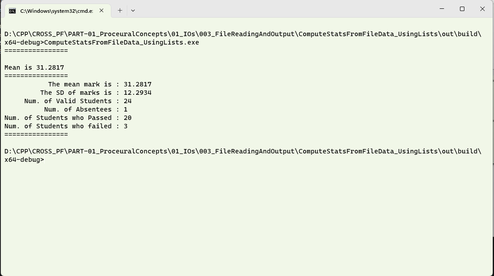

In this folder, the C++ code for reading data stored in files and operations related to handling them in different data structures and performing statistics is stored.
This program demonstrates the concepts of 'Call by reference' and 'call by value' also.
# Question #
Write a C++ program that reads a file with students' marks.  The first row of the data file has the data of the class for which the mark statistics are computed.  From the list, the program should output the number of members who passed, failed, and were absent.  Use lists to store the valid marks and compute the statistics.
A value of AA indicates absent, a mark less than 20 is considered failed. 
Compute the class average and the standard deviation.  It is sufficient to find the statistical parameters of the present persons only.  The file test.txt is given as a sample for you to run and check.  There are other hidden files which will be used to evaluate the work.
## About the proposed solution ##
A proposed solution has been attached.  The standard deviation is computed using the formula .  We choose the formula where the variance s based on the sample because, when a student is absent, the value is not considered.  The student who is absent is also part of the population, however, In order to demonstrate the concepts of 'Call by reference' and 'call by value', a function __getvariance__ is used.  For calculating the variance, the mean will be an intermediate value.  In this version of the program, the address of the location where the mean will be stored is passed as an argument.   The function, evaluates the variance and passes the value of the mean back to the calling function by modifying the value of mean in the original memory location where the calling function had stored it.
## Outline of Solution ##
Here is an outline of the steps you can follow to find the surface area and volume of a sphere:
1. Start by getting the file name where the student data is stored.  In this case, the path is hardcoded, but you can uncomment _line 55_ and be able to enter a custom file name.
2. A few switches have been added to the program as boolean values.  These switches determine the behaviour of different parts of the program.
3. The __main()__ method reads the file and determines the number of valid  marks (Marks where the candidate is not absent) that are available in the file.  Thes values are stored in a __list__.
4. Another function, __computeVariance()__ is defined, which takes a list and a pointer as required variables.  The last parameter, __boolDebugMode__ is an optional parameter.  If the user defines it by assigning a value to it, the the value which is passed by the user will be used.   If the user does not define them, then the bool DebugMode will be false.
5. Once the function __computeVariance()__ calculates the mean, it populates the memory location of where the calling function (in this case _main()_) stores the value of mean.
6. The variance is computed and the value is returned to the calling function.
7. The square root is found and the value is reported.
> **Note**
>  Using the switches is an elegant way to debug the program.  Play around changing the switches to _true_ and _false_.
## A word of caution in using the program ##
There is a chance that your compiler does not recogonise the line ending.  In the file attached, the line ending is __LF__, and in windows, if you need a __CR LF__ line ending, please open the same in a text editor like notepad++ and modify the line ending to suit your platform.
## Output in a Console ##
The output keeping the Boolean Switches of __debug mode__ and __not showing decorators__ to false and true respectively, the output is as given below. 

## Discussion of Output ##
